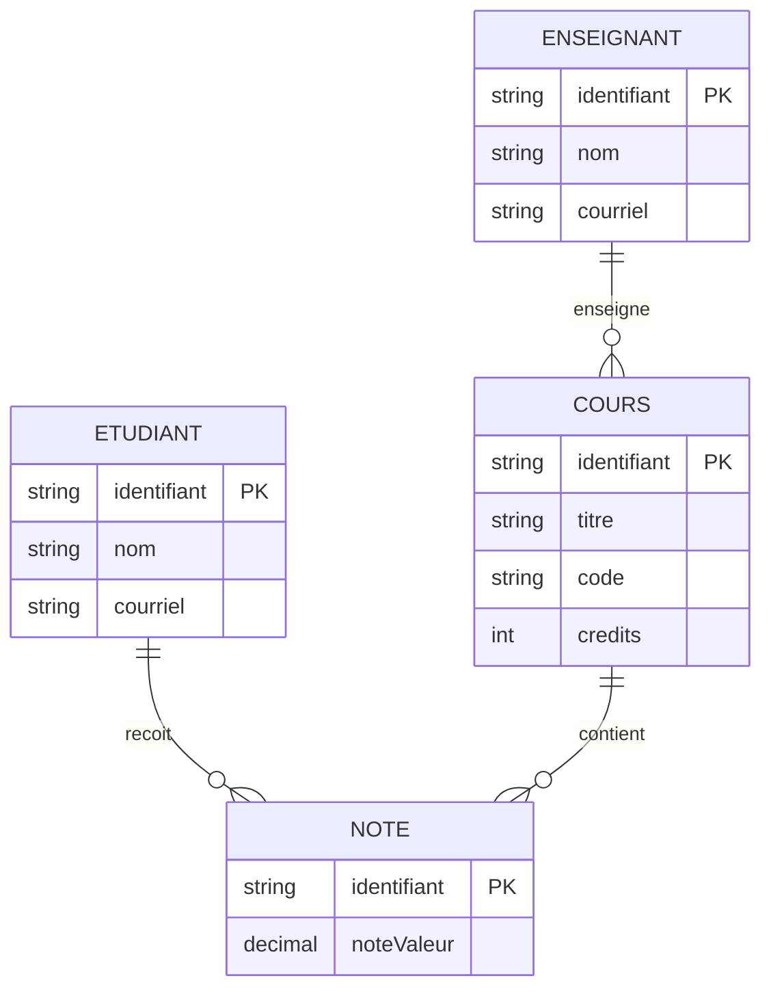
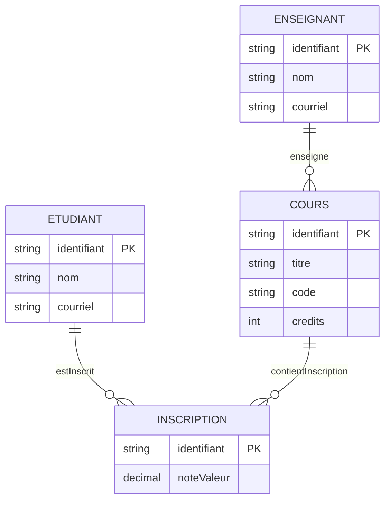

# Examen THYP du 9 décembre 2025

## Benakcha Iheb Chaker
## Diagramme Entité‑Association (Mermaid)

Voici un diagramme Entité‑Association (ER) en syntaxe Mermaid pour modéliser un vocabulaire RDF/Turtle gérant les évaluations des étudiants dans les cours d'un Master.

## Diagramme Entité‑Association (Mermaid)

Voici un diagramme Entité‑Association (ER) en syntaxe Mermaid pour modéliser un vocabulaire RDF/Turtle gérant les notes (grades) des étudiants dans les cours d'un Master — la notion d'"Evaluation" a été retirée.

